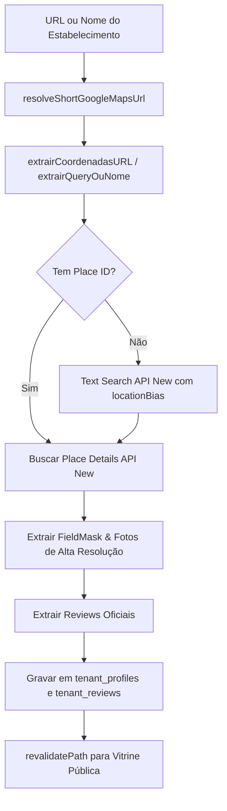

# 📍 Google Places API (New) Synchronization Skill

Esta skill define os padrões de sincronização, parsing de links e enriquecimento de dados da **Google Places API (New)** no ecossistema EssMendes Local.

---

## 🎯 Objetivos e Diretrizes Principais

1. **Zero Mock Data**: Nunca inserir dados fictícios ou avaliações inventadas. Se o estabelecimento não possuir fotos ou reviews oficiais na API, salvar apenas o que existe na resposta oficial.
2. **Parsing Universal de URLs**: Suportar links curtos (`maps.app.goo.gl`, `goo.gl/maps`), URLs completas do Maps, coordenadas geográficas (`@lat,lng` ou `!3dlat!4dlng`) e `place_id`.
3. **FieldMask Completo**: Sempre solicitar exclusivamente os campos necessários na Google Places API (New) para otimizar custo e performance.

---

## 🛠️ Arquitetura do Sincronizador

O sincronizador principal está localizado em:
- [`src/lib/actions/google-places.actions.ts`](file:///C:/Projetos/EssMendes-Local/src/lib/actions/google-places.actions.ts)
- [`src/services/google-maps.actions.ts`](file:///C:/Projetos/EssMendes-Local/src/services/google-maps.actions.ts)

### 1. Fluxo de Execução



### 2. FieldMask Obrigatório na API (New)

Ao chamar `https://places.googleapis.com/v1/places/{placeId}` ou `places:searchText`, incluir os headers:
```typescript
{
  "Content-Type": "application/json",
  "X-Goog-Api-Key": apiKey,
  "X-Goog-FieldMask": "id,displayName,formattedAddress,internationalPhoneNumber,nationalPhoneNumber,regularOpeningHours,rating,userRatingCount,reviews,photos,editorialSummary,primaryTypeDisplayName,location"
}
```

### 3. Extração e Resolução de Fotos em Alta Resolução

- Obter a lista `photos` da resposta do Google Places.
- Para cada foto, gerar a URL direta via endpoint de mídia do Google:
  `https://places.googleapis.com/v1/${photo.name}/media?maxHeightPx=1200&maxWidthPx=1600&key=${apiKey}`
- Armazenar até 10 fotos em `tenant_profiles.place_photos` (formato JSONB/Array de strings).

### 4. Sincronização de Reviews Oficiais

Ao sincronizar reviews:
1. Limpar reviews anteriores do tenant:
   ```sql
   DELETE FROM tenant_reviews WHERE tenant_id = :tenantId AND is_official_google = true;
   ```
2. Inserir exclusivamente os reviews reais retornados:
   ```typescript
   {
     tenant_id: tenantId,
     author_name: review.authorAttribution?.displayName || "Cliente Google",
     author_photo_url: review.authorAttribution?.photoUri,
     rating: review.rating,
     text: review.text?.text || "",
     relative_time_description: review.relativePublishTimeDescription,
     is_official_google: true
   }
   ```

---

## 🧪 Validação e Testes

Para testar o mecanismo de sincronização e parsing:
```bash
# Executar a bateria de testes de sincronização
node scripts/test_complete_suite.mjs
```
